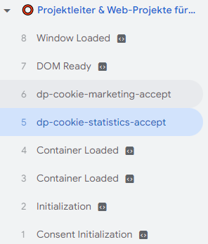
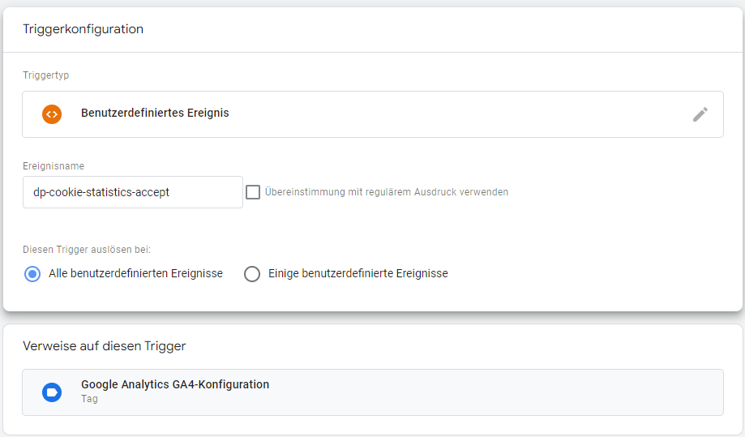

.. include:: ../../Includes.rst.txt

.. _config_overlay:

===========
Tracking
===========

Add Google Tag Manger and events for consent check.
Google Tag Manager will be loaded after each `plugin.tx_cookieconsent.settings.tracking.googleTagManager.on` consents, and push a specific datalayer event.

After that u can load Analytics with a custom trigger.

plugin.tx_cookieconsent.settings.tracking.googleTagManager.
=========

id
--------------------
:aspect:`Description`
   Google Tag Manager property

on
--------------------
:aspect:`Description`
   list of checkboxes that will load GTM and fire events
:aspect:`Options`
   statistics,marketing
:aspect:`Default`
   statistics,marketing